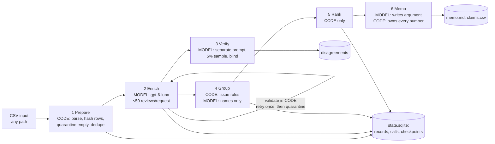

# Spotify review pipeline: where should Spotify's next quarter of product effort go?

> Sections headed **(Jordan, own words)** are Jordan's explanations. All other text describes measured results and
> saved files; every number below comes from a file linked next to it.

A multi-agent pipeline that classifies all 660,622 Spotify Google Play reviews (May 2022 – November 2023) and turns
them into a product recommendation in which every number traces back to saved calculations and review IDs.

**Answer:** prioritize **playback** next quarter. `playback.general` is the largest specific issue (priority score
117,894; 35,331 complaints, mean severity 3.34). Usability has the largest area total (179,800) but is spread across
several smaller issues. See the [decision memo](memo.md).

**Grader entry points:** [rubric map](#rubric-map) · [results](#results-summary) · [decision memo](#decision-memo) ·
[grading export](grading/) · [cost calculator](cost/README.md) · [golden evaluation](evals/golden/results_v1/summary.md)

---

## Rubric map

| Rubric criterion | Evidence |
|---|---|
| **Deliverable quality (4)** | |
| Accessible code/setup and artifacts | [Setup](#setup-and-commands); standard library only; offline replay and re-ranking need no key |
| Clear architecture, shared schema, provenance | [Architecture](#architecture); [labels/definitions.md](labels/definitions.md); [labels/record_schema.md](labels/record_schema.md); `label_config` on every record and call |
| Memo numbers linked to calculations and evidence | [Memo](#decision-memo) cites `C#` claims ([grading/claims.csv](grading/claims.csv)) and `X#` quantities; code rejects any other number |
| Coherent recommendation, alternatives, limitations | [Decision memo](#decision-memo); [paywall sensitivity](#ranking); [limitations](#limitations) |
| **Testing & evaluation (3)** | |
| 50 human labels, per-field comparison, error analysis | [Golden v1 results](evals/golden/results_v1/summary.md), [v2 with change log](evals/golden/results_v2/summary.md), [error analysis](#golden-50-evaluation) |
| Independent verification, planted-error and injection tests | [Verifier summary](evals/verify_full/summary.json) and [disagreements](evals/verify_full/disagreements.csv); [planted errors](evals/verify_full/planted_errors.json); [injection test](evals/injection/results.md) |
| Real cold/warm pilot, offline calculator, retry/spend/recovery controls | [cost/report.md](cost/report.md); [failed attempt 1](cost/attempt-1-memo-failed/NOTE.md); [controls](#controls-retries-spending-recovery) |
| **Working result (3)** | |
| Full ingestion, coverage, classification | [grading/ingestion.json](grading/ingestion.json); [course self-check](#course-self-check): all 660,622 IDs accounted for, coverage point 0.9999 |
| Runnable staged program, bounded calls, saved handoffs, resume | [Commands](#setup-and-commands); [interruption/resume evidence](#interruption-and-resume) |
| Reproducible baseline ranking, grounded final output | [Ranking](#ranking); `python3 -m pipeline.rerank --grading grading`; [memo](#decision-memo) |

---

## Results summary

**Measured (full run, `runs/full`, label_config `gpt-6-luna|effort=none|enrich-v2|schema-v2|labels-v2`)**

| | Value | Source |
|---|---|---|
| Source rows | 660,622, all accounted for (0 missing, 0 duplicate) | [grading/records.jsonl.gz](grading/) |
| Completed classifications | **660,539** of 660,609 nonempty (99.989%) | same |
| Quarantined | **83**: 13 `empty_review_text`; 61 `invalid_output_after_retry`; 9 duplicates of those 61 texts | same |
| Pending (unclassified) | 0 | same |
| Exact-text cache reuse | 176,411 rows reused a completed original's labels (`cache_source_id`) | same |
| Enrichment attempts / failed / invalid-output retry calls | 10,662 / 196 / 965 | [grading/calls.jsonl.gz](grading/) |
| Verifier agreement (5% sample, 24,416 reviews) | topic 87.2%, intent 94.0%, severity 89.8%, all three 75.7%; mean severity difference 0.11 | [evals/verify_full/summary.json](evals/verify_full/summary.json) |
| Planted wrong labels caught | 191 of 200 | [evals/verify_full/planted_errors.json](evals/verify_full/planted_errors.json) |
| API cost (full run) | **$10.94** (enrich $10.57, verify $0.33, group $0.002, memo $0.001) — base estimate was $11.07 | [evals/full_run_summary.json](evals/full_run_summary.json) |
| Wall-clock time | 55.5 s before the interruption + 7.7 h after resume (enrich 6.9 h, verify 49 min, group/rank/memo under 1 min) | same |
| **Total API spend, whole project** | **$11.15** (all smoke tests, pilots, checkpoints, golden, injection, full run, memo regeneration) | `runs/*/state.sqlite` |

**Measured (development checkpoints, before the full run)**

| Run | Reviews | Workers | API cost | Wall-clock | Verifier topic agreement |
|---|---|---|---|---|---|
| [100-review pilot](cost/report.md) (cold / warm) | 100 | 1 | $0.003919 / $0 | 38.8 s / 0.03 s | 19/20 |
| [500 checkpoint](cost/checkpoint_500-2w/report.md) | 500 | 2 | $0.0124 | 64 s | 22/25 |
| [10,000 checkpoint](cost/analysis_10000-4w/report.md) | 10,000 | 4 | $0.1904 | 518 s | 88% (419 reviews) |

**Golden 50:** strict agreement v1 — topic 76%, intent 92%, severity 68% (MAE 0.44); v2 (9 rule-based revisions,
made after seeing predictions) — topic 80%, intent 92%, severity 76% (MAE 0.32). Details in
[Golden-50 evaluation](#golden-50-evaluation).

**Estimated before the full run** (from the 10,000 checkpoint): base $11.07, conservative $16.04; ~6.8 h (base) with
4 workers. Budget cap $45. Estimates and measurements are kept separate in every report.

---

## Architecture

| Stage | Owner | Input → output | Failure behaviour / stop condition |
|---|---|---|---|
| 1 Prepare | code | CSV → records (pending / quarantined `empty_review_text`), row hashes | stops if a known row changed or settings differ |
| 2 Enrich | model + code | ≤50 distinct texts → validated labels; duplicates reuse results via `cache_source_id` | invalid items re-sent once (batches of 10), then quarantined; transient errors: 3 attempts with backoff; stops at spend cap, Ctrl-C, 5 consecutive failures |
| 3 Verify | model + code | 5% seeded sample, text only → independent labels → disagreement report | invalid items retried once, then `failed` (visible) |
| 4 Group | code + model | complaint/cancellation records → one issue each (rules); evidence pack → issue names | names citing outside IDs or containing digits rejected; one retry; rule-text fallback |
| 5 Rank | code | membership + severities → baseline, business view, paywall sensitivity | deterministic; byte-identical reruns |
| 6 Memo | model + code | aggregates + bounded evidence → memo with `{C#}`/`{X#}` references | any digit outside a reference, unknown claim, or outside review ID → rejected; one retry; no memo if still invalid |

### Who chooses the next step, and when the run stops (Jordan, own words)

The order of steps is fixed in code: ingest > enrich > verify > group > rank > memo. The model only reads the review text and picks the labels; it also re-labels a sample to verify them, names the issues, and writes the memo, but it never decides what runs next. The run stops when next request would go over the $45 cap, there are 5 failures in a row, I press Ctrl-C, the provider reports a permanent error (such as no credit), or every review is completed/quarantined, and saved progress lets it resume without re-labeling reviews already finished. The later stages only run once enrichment has finished. Between runs, I decided whether to scale up by looking at the cost/time report and the quality results after each test run (100 > 500 > 10,000)

### Why each model call is needed, and what code does instead (Jordan, own words)

I used the model only when it requires reading and understanding messy human language, or writing an argument from numbers that code has already computed. For example, enrichment needs a model because reviews contain slang, typos, mixed languages and sarcasm, there are just too many ways people can describe a problem, but code handles the rest by reading the file, sending each repeated text once and reusing the result for every copy, and copying the exact sentence the model points to so quotes are always exact. Ranking uses no model because it's just simple math and code will do it the same way every time.

---

## Labels and schema

- Shared definitions, examples and Jordan's decision log: [labels/definitions.md](labels/definitions.md)
- Record schema and who produces each field: [labels/record_schema.md](labels/record_schema.md)
- Prompts (versioned): [prompts/](prompts/) — final: `enrich-v2`, `verify-v1`, `group-v2`, `memo-v4` (earlier versions kept)
- Pipeline decisions with Jordan's reasoning: [docs/decisions.md](docs/decisions.md)

---

## Golden-50 evaluation

- Human labels: [v1 original](evals/golden/golden_50_human_labels_v1.csv) ·
  [v2](evals/golden/golden_50_human_labels_v2.csv) with [change log](evals/golden/golden_v2_changelog.csv)
  (9 rule-based revisions **made after seeing predictions**; v1 kept unchanged and both reported)
- Results: [v1](evals/golden/results_v1/summary.md) · [v2](evals/golden/results_v2/summary.md); per-case detail in
  `per_case.csv`
- Declared before evaluation: sentiment agrees within ±0.5; MAE also reported. Missing predictions count as wrong.
- The golden labels were completed after the enrichment prompt was frozen and never influenced any prompt, example,
  threshold or grouping rule.

### Error analysis (Jordan, own words)

Intent was most reliable (92%) because there are obvious signals and few intents with a clear order to check. Severity was weakest (68% in v1, 76% in v2); the model tended to rate problems more severely than I did, especially after my v2 revisions (it rated higher in 10 cases and lower in 2), e.g., when a sudden loud ad played and I rated a 2 and the model did 5. The largest group of topic errors came from confusing playback, usability, and access as these tend to overlap. This matters because severity drives rankings so severity errors shift things. With only 50 cases, one review can impact a score to the point of making a rough signal that is not exact accuracy.

---

## System checks

| Check | Result | Evidence |
|---|---|---|
| Independent verifier (full run, seeded 5% sample of distinct texts) | 24,416 verified, 0 failed; topic 87.2%, intent 94.0%, severity 89.8%; 5,945 reviews with any disagreement listed | [evals/verify_full/](evals/verify_full/) |
| Planted wrong labels (synthetic copy; real records untouched) | 191 of 200 deliberately wrong topics contradicted by the verifier | [evals/verify_full/planted_errors.json](evals/verify_full/planted_errors.json) |
| Prompt injection (6 attacks + 2 controls, synthetic) | 8/8 passed; no injected label adopted | [evals/injection/results.md](evals/injection/results.md) |
| Human inspection of the memo | caught a false comparison in memo-v3 that passed all automated checks; regenerated as memo-v4 | [evals/memo-inspection/](evals/memo-inspection/) |
| Safeguard tests (fake model, $0) | 63 tests pass | `python3 -m unittest discover -s tests -t .` |

### Course self-check
`python3 -m pipeline.grading_export --run full --out grading --check` runs the course's `check_submission.py`
(reference + audit) on the exported folder. Result: every one of the 660,622 IDs present once with the correct row
hash; 660,539 valid completed and 83 quarantined with reasons; 176,411 valid cache reuses; exact-quote, ranking,
claims, call-log and interruption/resume checks pass. The only flag is `unfinished_classification` for the 70
nonempty reviews that stayed quarantined (see the failed case below). Coverage point candidate: **0.9999**.

### Interruption and resume
- Recording: [evals/recovery/interruption_resume_demo_720p.m4v](evals/recovery/interruption_resume_demo_720p.m4v)
  (compressed copy; Jordan started the full run, pressed Ctrl-C, showed `status`, and re-ran the same command).
- Before: the `initial` run sent 13 enrichment requests, then stopped with `stop_reason: interrupted` after saving its
  in-flight requests. [grading/checkpoint_before.json](grading/checkpoint_before.json) lists **65,174** completed IDs
  (64,574 of them, 99.1%, are exact-duplicate copies of the first texts sent, e.g. "Good").
- After: the same command resumed with `phase: resume` and completed the run;
  [grading/checkpoint_after.json](grading/checkpoint_after.json) lists **660,539** completed IDs.
- No ID in the before-checkpoint appears in any `resume`-phase enrichment call, and every before-checkpoint ID was
  completed by an `initial` call or by cache reuse: the course checker's `resume_snapshot_mismatch`,
  `resume_call_evidence` and `reprocessed_checkpoint` checks all pass.

### Controls: retries, spending, recovery
- Spend cap $45 enforced before each request, counting in-flight reservations; unknown-usage calls count their full
  reservation. Output cap 4,000 tokens per request. 4 workers. No stronger-model fallback (declared fraction 0).
- Evidence: [cost/report.md](cost/report.md) Controls section; tests in `tests/`.

---

## Ranking

- Baseline (contract): `priority_score = severity_sum = complaint_count × mean_severity`; descending score, then
  ascending `issue_id`; means to six decimals, half-up. One issue per complaint (`allow_multi_issue: false`).
- Business view (additional, labeled): same numbers with `other.general` excluded.
- Paywall sensitivity (Jordan's decision 1c): named-feature paywall complaints re-scored from 3 to 2.
- Regenerate from the exported files without a model: `python3 -m pipeline.rerank --grading grading` (exits non-zero if the result differs from `grading/ranking.csv`)
- Results (full run; [grading/ranking.csv](grading/ranking.csv), [evals/rank_full/](evals/rank_full/)):

| Baseline rank | Issue | Complaints | Severity sum = priority | Mean severity |
|---|---|---|---|---|
| 1 | `other.general` (vague catch-all) | 90,127 | 178,774 | 1.983579 |
| 2 | `playback.general` | 35,331 | 117,894 | 3.336843 |
| 3 | `billing.paywall_named_feature` | 22,790 | 68,708 | 3.014831 |
| 4 | `usability.ads` | 27,830 | 64,246 | 2.308516 |
| 5 | `usability.general` | 19,755 | 49,361 | 2.498659 |

  Business view (excluding `other.general`): `playback.general`, `billing.paywall_named_feature`, `usability.ads`, …
  Area totals (severity sum): usability 179,800; playback (incl. downloads) 160,236; billing/support 149,052;
  access 38,464; catalog 49,733 and other 178,774 are outside the four areas.
  Paywall sensitivity: re-scoring 25,738 named-feature paywall complaints from 3 to 2 lowers that issue to 46,289 and
  leaves the top issue (`other.general`) and the top specific issue (`playback.general`) unchanged.

---

## Decision memo

**[memo.md](memo.md)** (memo-v4, generated by the memo role from saved aggregates; every number is a reference to
[grading/claims.csv](grading/claims.csv) or the quantities table at the end of the memo).

- **Priority:** playback, because `playback.general` is the top specific issue (C6 = 117,894; C5 mean severity
  3.336843), following Jordan's issue-level rule; the memo states that usability has the largest area total
  (X5 = 179,800).
- **Alternatives:** usability (led by `usability.ads`, C12 = 64,246), billing/support (led by
  `billing.paywall_named_feature`, C9 = 68,708), access (X2 = 38,464).
- **Representative reviews cited:** `98333d3d-0049-4711-a8c9-8daf98e04479` (playback keeps stopping),
  `98fee45a-083f-4315-a7f5-3a66f9bd22fd` (repeat removed; see Limitations).
- **Sensitivity and limitations:** included; 83 quarantined reviews disclosed (X21).

### My inspection of the memo's argument (Jordan, own words)

I checked the memo's comparisons against its own numbers table and ranking.csv, plus the two reviews it cites, read in the original data. The recommendation isn't consistent with the rule I declared before the full run because the memo says playback has the highest severity sum instead of usability but the numbers show that the statement is not true. It is consistent with the issue-level view however as playback is the top specific issue once `other.general` is excluded. I opened reviews 98333d3d and 07aa9843 and found both are correctly labeled playback failures. However, two examples are not much evidence for a group of 35,331 complaints. One weakness is the area totals depend on how issues are grouped. Usability is spread over many issues while playback is mostly one broad issue. The size and shape of the group affects which area or issue looks biggest

*Note on versions:* this inspection was of memo-v3, which passed every automated check but misstated which area had
the largest total. The memo was regenerated as memo-v4: it receives the area and issue order as code-computed facts,
states that usability has the largest area total (179,800), and recommends playback under the issue-level rule. Two
new code checks now enforce this (`tests/test_memo.py`, `IssueLevelRuleTests`). memo-v3 and its check are kept in
[evals/memo-inspection/](evals/memo-inspection/). memo-v4 has one formatting typo, left exactly as the model wrote it:
in its sensitivity section a closing backtick after `playback.general` was written as a brace. One review memo-v4
cites, `98fee45a` ("woooow can't even put a playlist on repeat anymore"), is labeled billing with
`paywall_named_feature = true` although it never mentions Premium; see [Limitations](#limitations).

---

## One failure explained (Jordan, own words)

In the first pilot, the memo was rejected 4 times. The main cause was a bug in the instructions rather than the model: we told the model not to write any numbers except reference to code-computed claims, but also gave it background text that contained dates, which are numbers. Three of the four rejections came from those dates; the fourth was the model's own miss, a recommendation that cited no claim. The check did its job by blocking a memo that broke the rules rather than publishing it. We fixed it by removing numbers from the background text, adding a check that rejects issue names containing numbers, and making the memo instructions clearer and reran the whole 100-review pilot, starting from an empty cache. What I learned is for whatever I give a model, it must follow the same rules its answer is checked against

Evidence: [cost/attempt-1-memo-failed/NOTE.md](cost/attempt-1-memo-failed/NOTE.md).

---

## One review traced end to end

Facts below are read from the saved files; they are not explanations.

**A real review: `a4602160-1498-4960-ab65-91d4e6bcec25`**

| Step | What happened | Where to check |
|---|---|---|
| Source | "Always says ur offline even when high speed internet is on... Foolish app" (rating 1, app 8.7.30.1221, 2022-05-17 08:00:16) | source CSV |
| Row hash | `8c50d4e842f47540bcc6ee624f7354ddae7add703837ded3c7a1b09329f2d8d2` | `source_sha256` in grading/records.jsonl.gz |
| Enrichment | sent once in request `resp_0ff9a01adb7d722b016ac1c1a3390c87d083fa62da65ab2795` (50 reviews, phase `initial`, succeeded) → playback / complaint / severity 4 / sentiment −1; evidence quote = segment 1, "Always says ur offline even when high speed internet is on..." (exact substring); entities `[offline]`; needs_review false | grading/calls.jsonl.gz, records |
| Verification | in the seeded 5% sample; the verifier, seeing only the text, answered playback / complaint / 4 — full agreement (request `resp_08720387529368c7016ac2233e8ab487d08c24ce0e564109af`) | evals/verify_full/ |
| Issue membership | `playback.general,a4602160-…` (topic playback; no `crash`/`car`/`podcast` entity, so the catch-all facet) | grading/membership.csv |
| Ranking | contributes severity 4 to `playback.general`: rank 2, 35,331 complaints, severity sum 117,894, mean 3.336843 | grading/ranking.csv |
| Memo claim | C5 (mean severity 3.336843) and C6 (priority score 117,894) of `playback.general`, the basis of the recommendation | grading/claims.csv, memo.md |

**A failed case: `03e07dd0-3f15-41d8-b4af-6ad3f21f70d7`** ("Greatest music platform yet")
- First sent in a 50-review request at 03:18 UTC whose response could not be parsed (`unparseable_json`); nothing
  from that response could be saved, so all 50 reviews were queued for the one allowed retry.
- Retried at 09:46 UTC in a 10-review request; that response was also `unparseable_json`.
- Handling decision: quarantined with reason `invalid_output_after_retry`, attempts 2; not counted as a completed
  classification and excluded from the ranking; the review text is ordinary, so the failure is a batch-level output
  failure, not a hard review. 61 reviews were quarantined after one retry (their 7 failed retry requests: 4 unparseable, 2 cut off, 1 with an
  invalid item), plus 9 duplicate copies
  of their texts. A future version should retry a failed retry batch one review at a time.

---

## Limitations
- Self-selected, public, historical reviews; not representative of all users. No revenue, plan tier or confirmed churn;
  cancellation intent is not observed churn.
- Model labels are imperfect (see golden and verifier agreement); severity tends to be rated high.
- 70 nonempty reviews (0.011%) stayed quarantined after one retry and are not classified (see the failed case).
- Issue groups come from fixed rules on matched feature words; `other.general` is broad.
- **The model sometimes used outside knowledge.** Some reviews were labeled as Premium paywall complaints although the
  text never mentions Premium or payment (e.g. `98fee45a`, "can't even put a playlist on repeat anymore"), likely
  because the model knows about Spotify's 2023 free-tier changes. Measured by code on the full run: of 27,059
  `paywall_named_feature` labels, 5,666 (20.9%) contain no premium/pay/price/subscription/free/upgrade/currency word;
  of 60,773 `billing` labels, 8,503 (14.0%). This is an upper bound (the word list misses e.g. "fee", and limits such
  as "6 skips per hour" are known free-tier rules). Re-labeling would require a new prompt version and a full re-run,
  so it is disclosed instead. Effect on the recommendation: even if the 3,864 such reviews were removed from
  `billing.paywall_named_feature`, its priority score would fall from 68,708 to 57,060 (below `usability.ads`
  at 64,246), and the top specific issue, `playback.general` (117,894), would not change. A future prompt version
  should say: label only what the text states; do not infer that a feature is Premium-only unless the review says so.
- The first and last calendar months are partial (May 17 – Nov 15).

---

## Setup and commands

**Requirements:** Python 3.10+ (developed on 3.14), standard library only — no packages to install.

**Data:** download the course dataset ZIP and unzip it next to this repository as
`../Final Assignment - Spotify Reviews Dataset/`. The 97.4 MB CSV is not committed. Source: BwandoWando,
*3.4 Million Spotify Google Store Reviews* v2 (Kaggle, CC0). Full CSV SHA-256:
`1fc85de68a304dd8978b537cfa58793d5f41cbaf417fa32cb53899f83a2fcef6`.

**Keys (only for paid runs):** `cp .env.example .env` and set `OPENAI_API_KEY`. `.env` is git-ignored. Offline replay,
re-ranking and the self-check need no key.

| Purpose | Command | Paid? |
|---|---|---|
| All stages on any CSV (fake model) | `python3 -m pipeline run --input PATH.csv --run NAME` | no |
| All stages, real model | `... --client openai --confirm-paid --workers 4` | **yes** |
| Progress / checkpoint of a run | `python3 -m pipeline status --run NAME` | no |
| Cost calculator, offline replay | `python3 cost/calculator.py` | no |
| 100-review pilot (cold + warm) | `python3 cost/calculator.py pilot --confirm-paid` | **yes** |
| Golden evaluation | `python3 evals/evaluate_golden.py` | no |
| Grading export + course self-check | `python3 -m pipeline.grading_export --run full --out grading --check` | no |
| Tests (fake model) | `python3 -m unittest discover -s tests -t .` | no |
| Re-rank from exported files (no model) | `python3 -m pipeline.rerank --grading grading` | no |

**Large files:** `runs/` (≈0.5 GB of run databases) is not committed; everything needed for grading is exported to
`grading/`, `cost/` and `evals/`. The original full-resolution screen recording is kept locally; a 720p copy is
committed.
